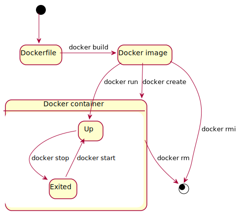

= Dockerの備忘録

== 状態遷移

.Dockerの
[cols="2*", options="header"]
|===
|名前
|説明

|Dockerfile
|Docker imageを定義したファイル

|Docker image
|

|Docker container
|

|===

.状態の説明
[cols="2*", options="header"]
|===
|状態
|説明

|Up
|起動中

|Exited
|停止中
|===

== コマンド